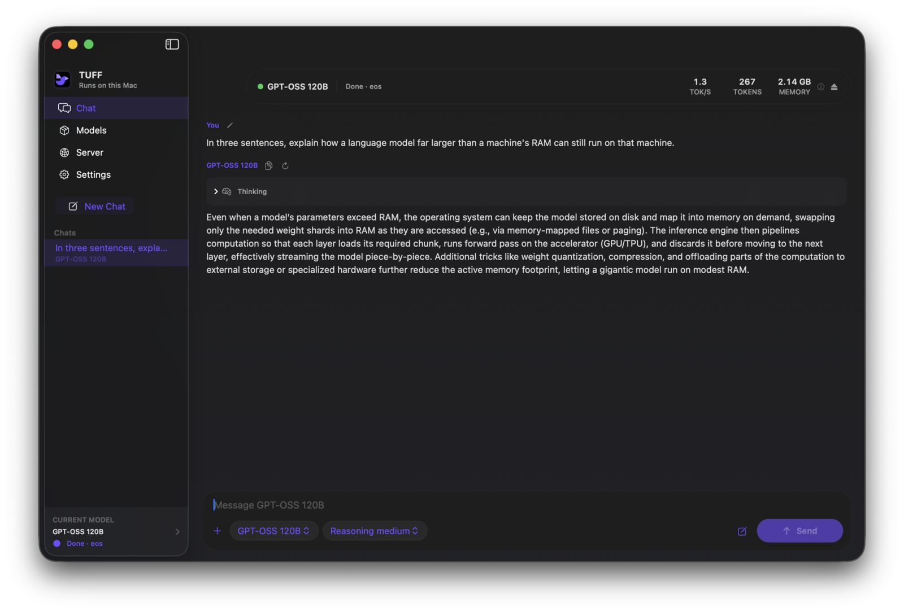

<p align="center">
  
</p>

<h1 align="center">TUFF</h1>

<p align="center">
  <strong>GPT-OSS 120B on a 16 GB Mac. Qwen3.6 35B-A3B down to an 8 GB Mac.</strong><br>
  Run large language models locally on Apple Silicon.<br>
  Native Swift, Metal, and an SSD-aware runtime that does not pretend memory is unlimited.
</p>

<p align="center">
  <a href="https://github.com/rexmhall09/TUFF/releases/latest"><strong>Download TUFF</strong></a>
  · <a href="https://rexmhall09.github.io/TUFF/">Website</a>
  · <a href="CONTRIBUTING.md">Contribute</a>
</p>



## What TUFF is

TUFF is a Mac app and inference engine for running a small set of models really
well on Apple Silicon. It includes the chat app, model downloader, Metal
runtime, command-line tools, and a local OpenAI-compatible server. It does not
wrap MLX or llama.cpp.

The project started with one unusual idea: large mixture-of-experts models do
not need every expert in memory at once. TUFF keeps the shared parts of a model
resident, reads the experts it needs from SSD, and reuses them through a bounded
cache. That is how I can run the 61 GiB GPT-OSS 120B checkpoint on my 16 GB M2
MacBook Air without swap.

Version 3 is a much bigger project than the original app. It has seven models,
persistent and continuous chats, Markdown and native LaTeX rendering on both
sides of the conversation, image and file attachments, per-model settings, a
shared local server, hardware eligibility checks, and signed binary updates.

## Why TUFF

Most local runners load a whole model into memory, so the largest model you can
run is the one that fits. TUFF keeps only the shared weights resident and streams
mixture-of-experts weights from SSD through a bounded cache, so model size is
governed by disk rather than by RAM.

That trade is not free. Streaming costs decode speed, and a model that fits
comfortably in memory will be faster in a runner built around that assumption.
TUFF is aimed at the case where the model does not fit at all.

| | TUFF | LM Studio | Ollama | Colibri | turbo-fieldfare |
| --- | :-: | :-: | :-: | :-: | :-: |
| Runs models bigger than your memory | ✅ | ❌ | ❌ | ✅ | ✅ |
| Built specifically for Apple Silicon | ✅ | ◐ | ◐ | ❌ | ✅ |
| Open source | ✅ | ◐ | ✅ | ✅ | ✅ |
| Desktop app rather than a CLI | ✅ | ✅ | ❌ | ❌ | ✅ |
| Local OpenAI-compatible server | ✅ | ✅ | ✅ | ❌ | ✅ |
| Image input | ✅ | ✅ | ✅ | ❌ | ◐ |
| Signed automatic updates | ✅ | ✅ | ✅ | ❌ | ❌ |
| Good on models that already fit in RAM | ◐ | ✅ | ✅ | ❌ | ◐ |
| Large model library | ◐ | ✅ | ✅ | ❌ | ❌ |
| Windows and Linux | ❌ | ✅ | ✅ | ✅ | ❌ |

✅ yes · ◐ partly · ❌ no

TUFF ships seven models rather than a library, but each one is pinned to a
revision, checksum-verified on install, and qualified on real hardware before it
appears. LM Studio and Ollama reach Apple Silicon through MLX and Metal backends;
TUFF and turbo-fieldfare are written for it and run nowhere else. LM Studio's
desktop app is proprietary, while its CLI and SDKs are MIT.

TUFF is a fork of [drumih/turbo-fieldfare](https://github.com/drumih/turbo-fieldfare),
which established the expert-streaming runtime for one Gemma checkpoint. v2 turned
that into a five-model platform with a rebuilt app, a second quantization format,
a dense architecture path, and a shared local server.

Pick something else if you want a large model library, Windows or Linux, or the
fastest possible decode for a model that already fits in your memory. TUFF is
for the case where the model does not fit at all, on a Mac, in an app.

## Download the app

TUFF requires an Apple Silicon Mac running macOS 15 or newer.

1. Download `TUFF-vX.Y.Z-macos-arm64.zip` from the
   [latest GitHub release](https://github.com/rexmhall09/TUFF/releases/latest).
2. Open the ZIP and move `TUFF.app` into Applications.
3. Open TUFF, choose Models, and download the model you want.

### About the security warning

TUFF is ad-hoc signed and is not notarized, because notarizing requires a paid
Apple Developer account. macOS will therefore warn you that it cannot verify the
developer, and may refuse to open the app on first launch.

To open it anyway, Control-click TUFF and choose **Open**, then confirm **Open**
again. You can also allow it from **System Settings > Privacy & Security** right
after the first attempt.

If you would rather not click through that warning, don't. Two better options:

- **Read the source.** Every line of this app is in this repository, including
  the packaging script that produces the exact release archive.
- **Build it yourself.** A build you produce locally is signed by your own
  machine and opens without any warning. See
  [Build it yourself](#build-it-yourself); it is one command once you have Xcode
  and Swift installed.

You can also verify that the archive you downloaded is the one published, by
comparing it against the `.sha256` file attached to the same release:

```bash
shasum -a 256 TUFF-vX.Y.Z-macos-arm64.zip
```

TUFF checks for signed updates automatically. Automatic download and
installation are on by default and can be changed in Settings. The updater only
accepts archives signed by TUFF's embedded EdDSA key.

## The app

The interface has four places:

- **Chat** keeps named conversations, restores them after a restart, and binds
  each conversation to its model. Return sends by default. If the selected
  model is installed but unloaded, sending a message loads it and continues
  automatically. The conversation is one continuous scroll: images, files and
  reasoning belong to the message they were sent with, and every answer is
  labelled with the model that produced it, so a chat that switched models
  mid-way still says which answer came from where. The model picker in the
  message box offers the models that are on this Mac; downloads live in Models.
- **Models** shows all seven checkpoints and their real disk and memory
  requirements. Image support lives inside the model card as a separate,
  optional download.
- **Server** runs an OpenAI-compatible endpoint on `127.0.0.1`. Chat and Server
  share one decode service, so TUFF never starts a second copy of the model.
- **Settings** keeps simple chat behavior separate from per-model context,
  sampling, cache, prefill, and memory controls.

Both sides of the conversation render headings, lists, links, quotes, code
blocks, inline code, emphasis, and LaTeX math such as `$a^2 + b^2 = c^2$`. Math
is typeset locally. Nothing is sent to a web renderer.

Text, Markdown, CSV, JSON and PDF attach as files rather than as pasted text.
The extracted text is what the model reads — every model reads text — but the
composer and the transcript show the file, with its name and an estimate of how
much of the context it uses. A file stays with its message, so a follow-up
question can still refer to it.

## Models

Every model source is pinned to an exact revision and fingerprint. Downloads go
straight into the final `.gturbo` installation, so TUFF does not stage a second
copy of a checkpoint first.

| Model | What I would use it for | Installed size | Minimum memory | Add-ons |
| --- | --- | ---: | ---: | --- |
| Gemma 4 E2B IT | The smallest model here | 2.64 GB | 8 GB | Image input |
| Gemma 4 E4B IT | A small and quick general model | 4.23 GB | 8 GB | Image input |
| Gemma 4 12B IT QAT | Dense quality without a mixture of experts | 10.98 GB | 16 GB | Image input |
| Gemma 4 26B-A4B IT | The balanced default | 14.29 GB | 8 GB | Image input |
| Qwen3.6 35B-A3B | Coding, long context, and images | 19.55 GB | 8 GB | Image input |
| GPT-OSS 20B | Reasoning and local tool workflows | 13.79 GB | 16 GB | None |
| GPT-OSS 120B | The largest and highest-quality option | 65.4 GB | 16 GB | None |

Gemma and Qwen expose thinking on or off. GPT-OSS exposes low, medium, and high
reasoning. Qwen can also preserve thinking between turns from its advanced
profile.

TUFF reads physical unified memory with `hw.memsize`, then checks the selected
model, context length, KV layout, cache slots, and a system reserve. Models that
are not safe for a Mac stay visible but gray, with Download and Load disabled
and an explanation. Disk space is checked separately.

The memory limits above come from real model runs. They are not guesses based
on parameter count. GPT-OSS 120B completed a coherent 4K-context run on my 16 GB
M2 with a 7.44 GiB peak process footprint and zero swap. This proves that the
configuration runs on that machine. It is not a claim that it will be fast for
every workload.

### Benchmarks

Every number below was measured on my own M2 MacBook Air (`Mac14,2`, 16 GB,
macOS 26.5.2, Swift 6.3.1) on AC power, using a fresh release CLI process per
run and `/usr/bin/time -l`. Prompt length, generated length, cache state, and
hardware all move these numbers, so a range across workloads is not run-to-run
variance.

One short question, `What is the capital of France?`, one process per model.
Decode rate excludes install, load, and prefill. Every model answered correctly:

| Model | Decode | Prefill | Peak RSS |
| --- | ---: | ---: | ---: |
| Gemma 4 E4B IT | 17.05 tok/s | 1.02 s | 374 MiB |
| Gemma 4 26B-A4B IT | 7.82 tok/s | 6.92 s | 1,844 MiB |
| Qwen3.6 35B-A3B | 7.15 tok/s | 9.65 s | 1,406 MiB |
| GPT-OSS 20B | 3.73 tok/s | 13.32 s | 1,932 MiB |
| GPT-OSS 120B | 0.49 tok/s | 47.58 s | 1,659 MiB |

Reproduce it with `Scripts/benchmark_simple.rb`. Peak RSS understates what a
model costs, because the weights are memory-mapped and the kernel owns those
pages; the longer-workload rows below report footprint alongside RSS for that
reason.

Longer workloads on Gemma 4 E4B, at temperature `0.2`, Top-K `64`, Top-P `0.95`,
with a frozen prompt and seed. Both runs were coherent and stopped at end of
turn:

| Case | Context | Prompt / generated | Prefill | Decode | Peak RSS / footprint |
| --- | ---: | ---: | ---: | ---: | ---: |
| short-explanation | 4,096 | 57 / 440 | 3.08 s | 9.267 tok/s | 406.2 / 872.2 MiB |
| long-synthesis | 8,192 | 3,011 / 369 | 204.40 s | 6.820 tok/s | 582.3 / 1,748.5 MiB |

GPT-OSS 120B is the headline case: a verified 61 GiB install, run at 4,096-token
context with Low reasoning and 16 expert-cache slots, returning the requested
answer and stopping at EOS on a 16 GB machine with no swap. That establishes the
configuration runs on that hardware. It is not a claim that it is fast.

The 8 GB figures in the model table are a memory calculation, not a measurement.
They combine each model's measured peak footprint with TUFF's 2 GiB system
reserve. I have not run these models on an 8 GB Mac.

## Images

Every Gemma 4 model and Qwen3.6 use optional `.vision.gturbo` companion packs.
They are separate because a text-only user should not have to download image
weights. Install or remove the add-on from its model card.

A pack is bound to the exact text checkpoint it was built from, not just to the
model family. Installing one against a different checkpoint is refused at
download time rather than at first image.

Image input fails closed. If the companion is missing, corrupt, built for a
different model, or unsupported by the Mac, TUFF rejects the image. It never
silently drops an image and answers the remaining text.

Images stay in the conversation. A follow-up question is answered by a model
that can still see the picture, up to as many images as the context window
holds; older ones are dropped from the context, oldest first, exactly as older
turns are.

## Local server

The easiest way to start the server is from the Server screen in the app. The
supported endpoints are:

- `GET /health`
- `GET /v1/models`
- `POST /v1/chat/completions`

Chat Completions supports regular JSON, streaming SSE, model-aware reasoning,
function-tool declarations, prompt reuse, and images when the matching add-on
is installed. The client remains responsible for approving and executing every
tool call.

The server has no authentication or TLS. It binds only to `127.0.0.1`, and it
should not be proxied, tunneled, or exposed to another machine. Point any
OpenAI-compatible client at `http://127.0.0.1:<port>/v1` with any API key value;
`GET /v1/models` reports the identifier to send as `model`.

## Build it yourself

You need macOS 15+, Swift 6.2+, Metal 3.2+, and an Apple Silicon Mac.

```bash
git clone https://github.com/rexmhall09/TUFF.git
cd TUFF
swift build -c release
.build/release/TUFF
```

To build the complete app bundle, embedded updater, ZIP, and checksum:

```bash
Scripts/package_app.sh 3.0.2
open dist/TUFF.app
```

The clone-style executable looks for models under `scratch/`. The packaged app
keeps everything it owns in one place, `~/Library/Application Support/TUFF`,
with models in `Models/` and saved chats in `Chats/`. Models left in the older
`TurboFieldfare` directory by an earlier version are moved across on first
launch. Existing compatible v1 Gemma and Qwen installations remain readable.

### Command-line interface

The stable installer selectors are `gemma4-e2b`, `gemma4-e4b`,
`gemma4-12b-qat`, `gemma4`, `qwen36`, `gpt-oss-20b`, and `gpt-oss-120b`:

```bash
swift run -c release TUFFRepack \
  --model gpt-oss-20b \
  --output scratch/gpt-oss-20b.gturbo
```

Interrupted downloads keep their verified ranges. Continue with `--resume`, or
remove saved download state with `--discard-partial`.

Run a local chat from the CLI:

```bash
swift run -c release TUFFCLI \
  --model scratch/gpt-oss-20b.gturbo \
  --chat-prompt "Why does bounded expert streaming matter?" \
  --reasoning low \
  --max-new 256
```

## How it works

One Foundation-only registry describes each checkpoint's source, fingerprint,
installation, hardware rules, architecture, add-ons, prompt dialect, and
defaults. The app, installer, CLI, and server all use that registry.

The runtime then separates the checkpoint from the architecture behavior:

- dense and mixture-of-experts feed-forward paths
- Gemma, Qwen ChatML, and GPT-OSS Harmony prompts
- affine INT4 and GPT-OSS MXFP4 weights
- model-specific attention, routing, RoPE, KV, and memory plans
- bounded expert reads and bounded chunked-prefill scratch
- FP32 GPT-OSS residuals with FP16 projection, attention, expert, and KV paths

The `.gturbo` major version is still v1. A compatible minor extension describes
dense feed-forward and MXFP4 layouts. Older runtimes reject features they do not
understand instead of misreading the model.

The file format, memory ownership, Metal kernels, prefill, expert streaming,
prompt reuse, and image companions are documented in the source, which is the
copy that stays current.

## Tests

Run the serial package suite with:

```bash
Scripts/test.sh
```

Before a real model run, make sure there is enough disk space, memory pressure
is acceptable, the model installation is complete, and no other TUFF app, CLI,
server, decode service, test, or MLX process is using a model. Run one model
process at a time.

The test strategy includes CPU references for Metal kernels, toy-model forward
and prefill checks, format and repack verification, tokenizer and template
goldens, installer failure paths, persistent-chat tests, server contention,
update configuration, deterministic workspace renders, and real checkpoint
smokes. A green model-free suite does not prove that a checkpoint works.

## Contributing

I want all kinds of contributions that make TUFF better. Code, design, model
support, bug reports, accessibility, docs, tests, benchmark results, and small
quality-of-life fixes are all useful. You do not need to be a Swift or Metal
expert.

AI-assisted contributions are 100% welcome. Name the tool or model when you
know it, explain what it helped with, and review and test the result yourself.
You are still responsible for the code you submit.

Read [CONTRIBUTING.md](CONTRIBUTING.md) for the technical guardrails, test
commands, model qualification requirements, and what to include in a pull
request.

## AI and authorship

I use several AI models while building TUFF. They help me research,
write code, make tests, review changes, and edit documentation. I review the work, and take responsibility for the
project. AI assistance is part of how I build it. It does not make the project
less mine. Any other contributors are welcome to use AI, as long as they review code.

## License and credit

TUFF source and documentation use the [Apache License 2.0](LICENSE). Model
weights are not included and keep their original terms. Third-party package and
font details are in [THIRD_PARTY_NOTICES.md](THIRD_PARTY_NOTICES.md).

TUFF began as a fork of
[drumih/turbo-fieldfare](https://github.com/drumih/turbo-fieldfare) by Andrey
Mikhaylov. That project established the original Gemma runtime, bounded expert
streaming, and much of the foundation I still build on. TUFF is now evolving as
its own project, but I want the origin and credit to stay clear.
