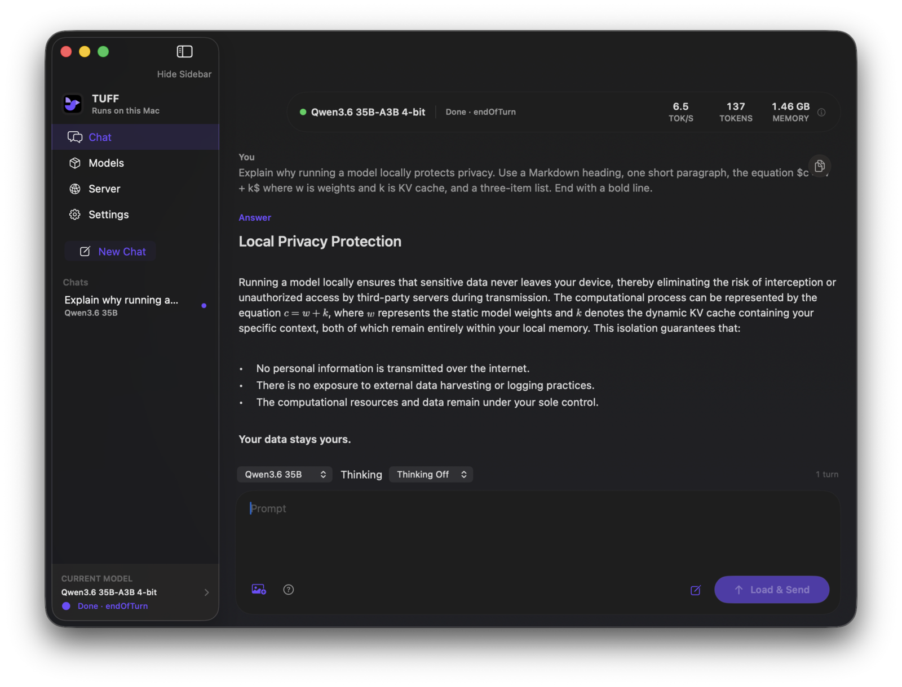

<p align="center">
  
</p>

<h1 align="center">TUFF</h1>

<p align="center">
  Run large language models locally on Apple Silicon.<br>
  Native Swift, Metal, and an SSD-aware runtime that does not pretend memory is unlimited.
</p>

<p align="center">
  <a href="https://github.com/rexmhall09/TUFF/releases/latest"><strong>Download TUFF 2.0.0</strong></a>
  · <a href="docs/OPENAI_SERVER.md">Server guide</a>
  · <a href="CONTRIBUTING.md">Contribute</a>
</p>



## What TUFF is

TUFF is a Mac app and inference engine for running a small set of models really
well on Apple Silicon. It includes the chat app, model downloader, Metal
runtime, command-line tools, and a local OpenAI-compatible server. It does not
wrap MLX or llama.cpp.

The project started with one unusual idea: large mixture-of-experts models do
not need every expert in memory at once. TUFF keeps the shared parts of a model
resident, reads the experts it needs from SSD, and reuses them through a bounded
cache. That is how I can run the 61 GiB GPT-OSS 120B checkpoint on my 16 GB M2
MacBook Air without swap.

Version 2 is a much bigger project than the original app. It has five models,
persistent chats, Markdown and native LaTeX rendering, image add-ons, per-model
settings, a shared local server, hardware eligibility checks, and signed binary
updates.

## Download the app

TUFF requires an Apple Silicon Mac running macOS 15 or newer.

1. Download `TUFF-v2.0.0-macos-arm64.zip` from the
   [latest GitHub release](https://github.com/rexmhall09/TUFF/releases/latest).
2. Open the ZIP and move `TUFF.app` into Applications.
3. Open TUFF, choose Models, and download the model you want.

This release is ad-hoc signed and is not notarized. On first launch, macOS may
refuse to open it normally. Control-click TUFF, choose **Open**, then confirm
**Open** again. You can also allow it from **System Settings > Privacy &
Security**.

TUFF checks for signed updates automatically. Automatic download and
installation are on by default and can be changed in Settings. The updater only
accepts archives signed by TUFF's embedded EdDSA key.

## The app

The interface has four places:

- **Chat** keeps named conversations, restores them after a restart, and binds
  each conversation to its model. Return sends by default. If the selected
  model is installed but unloaded, sending a message loads it and continues
  automatically.
- **Models** shows all five checkpoints and their real disk and memory
  requirements. Image support lives inside the model card as a separate,
  optional download.
- **Server** runs an OpenAI-compatible endpoint on `127.0.0.1`. Chat and Server
  share one decode service, so TUFF never starts a second copy of the model.
- **Settings** keeps simple chat behavior separate from per-model context,
  sampling, cache, prefill, and memory controls.

Assistant responses render headings, lists, links, quotes, code blocks, inline
code, emphasis, and LaTeX math such as `$a^2 + b^2 = c^2$`. Math is typeset
locally. Nothing is sent to a web renderer.

## Models

Every model source is pinned to an exact revision and fingerprint. Downloads go
straight into the final `.gturbo` installation, so TUFF does not stage a second
copy of a checkpoint first.

| Model | What I would use it for | Installed size | Minimum memory | Add-ons |
| --- | --- | ---: | ---: | --- |
| Gemma 4 E4B IT | A small and quick general model | 4.23 GB | 8 GB | None |
| Gemma 4 26B-A4B IT | The balanced default | 14.29 GB | 8 GB | Image input |
| Qwen3.6 35B-A3B | Coding, long context, and images | 19.55 GB | 8 GB | Image input |
| GPT-OSS 20B | Reasoning and local tool workflows | 13.79 GB | 16 GB | None |
| GPT-OSS 120B | The largest and highest-quality option | 65.4 GB | 16 GB | None |

Gemma and Qwen expose thinking on or off. GPT-OSS exposes low, medium, and high
reasoning. Qwen can also preserve thinking between turns from its advanced
profile.

TUFF reads physical unified memory with `hw.memsize`, then checks the selected
model, context length, KV layout, cache slots, and a system reserve. Models that
are not safe for a Mac stay visible but gray, with Download and Load disabled
and an explanation. Disk space is checked separately.

The memory limits above come from real model runs. They are not guesses based
on parameter count. GPT-OSS 120B completed a coherent 4K-context run on my 16 GB
M2 with a 7.44 GiB peak process footprint and zero swap. This proves that the
configuration runs on that machine. It is not a claim that it will be fast for
every workload.

See [Benchmarks](docs/BENCHMARKS.md) for the exact hardware, commands, settings,
and measurements. The [community benchmark guide](docs/COMMUNITY_BENCHMARKS.md)
explains how to submit a comparable result.

## Images

Gemma 4 26B and Qwen3.6 use optional `.vision.gturbo` companion packs. They are
separate because a text-only user should not have to download image weights.
Install or remove the add-on from its model card.

Image input fails closed. If the companion is missing, corrupt, built for a
different model, or unsupported by the Mac, TUFF rejects the image. It never
silently drops an image and answers the remaining text.

## Local server

The easiest way to start the server is from the Server screen in the app. The
supported endpoints are:

- `GET /health`
- `GET /v1/models`
- `POST /v1/chat/completions`

Chat Completions supports regular JSON, streaming SSE, model-aware reasoning,
function-tool declarations, prompt reuse, and images when the matching add-on
is installed. The client remains responsible for approving and executing every
tool call.

The server has no authentication or TLS. It binds only to `127.0.0.1`, and it
should not be proxied, tunneled, or exposed to another machine. The full request
format and client examples are in the [server guide](docs/OPENAI_SERVER.md).

## Build it yourself

You need macOS 15+, Swift 6.2+, Metal 3.2+, and an Apple Silicon Mac.

```bash
git clone https://github.com/rexmhall09/TUFF.git
cd TUFF
swift build -c release
.build/release/TUFF
```

To build the complete app bundle, embedded updater, ZIP, and checksum:

```bash
Scripts/package_app.sh 2.0.1
open dist/TUFF.app
```

The clone-style executable looks for models under `scratch/`. The packaged app
keeps everything it owns in one place, `~/Library/Application Support/TUFF`,
with models in `Models/` and saved chats in `Chats/`. Models left in the older
`TurboFieldfare` directory by an earlier version are moved across on first
launch. Existing compatible v1 Gemma and Qwen installations remain readable.

### Command-line interface

The stable installer selectors are `gemma4-e4b`, `gemma4`, `qwen36`,
`gpt-oss-20b`, and `gpt-oss-120b`:

```bash
swift run -c release TUFFRepack \
  --model gpt-oss-20b \
  --output scratch/gpt-oss-20b.gturbo
```

Interrupted downloads keep their verified ranges. Continue with `--resume`, or
remove saved download state with `--discard-partial`.

Run a local chat from the CLI:

```bash
swift run -c release TUFFCLI \
  --model scratch/gpt-oss-20b.gturbo \
  --chat-prompt "Why does bounded expert streaming matter?" \
  --reasoning low \
  --max-new 256
```

## How it works

One Foundation-only registry describes each checkpoint's source, fingerprint,
installation, hardware rules, architecture, add-ons, prompt dialect, and
defaults. The app, installer, CLI, and server all use that registry.

The runtime then separates the checkpoint from the architecture behavior:

- dense and mixture-of-experts feed-forward paths
- Gemma, Qwen ChatML, and GPT-OSS Harmony prompts
- affine INT4 and GPT-OSS MXFP4 weights
- model-specific attention, routing, RoPE, KV, and memory plans
- bounded expert reads and bounded chunked-prefill scratch
- FP32 GPT-OSS residuals with FP16 projection, attention, expert, and KV paths

The `.gturbo` major version is still v1. A compatible minor extension describes
dense feed-forward and MXFP4 layouts. Older runtimes reject features they do not
understand instead of misreading the model.

Read [System design](docs/SYSTEM_DESIGN.md) for the file format, memory
ownership, Metal kernels, prefill, expert streaming, prompt reuse, and image
companions. The [experiment inventory](docs/experiments/EXPERIMENT_INVENTORY.md)
keeps the optimization record, including the things that did not work.

## Tests

Run the serial package suite with:

```bash
Scripts/test.sh
```

Before a real model run, make sure there is enough disk space, memory pressure
is acceptable, the model installation is complete, and no other TUFF app, CLI,
server, decode service, test, or MLX process is using a model. Run one model
process at a time.

The test strategy includes CPU references for Metal kernels, toy-model forward
and prefill checks, format and repack verification, tokenizer and template
goldens, installer failure paths, persistent-chat tests, server contention,
update configuration, deterministic workspace renders, and real checkpoint
smokes. A green model-free suite does not prove that a checkpoint works.

## Contributing

I want all kinds of contributions that make TUFF better. Code, design, model
support, bug reports, accessibility, docs, tests, benchmark results, and small
quality-of-life fixes are all useful. You do not need to be a Swift or Metal
expert.

AI-assisted contributions are 100% welcome. Name the tool or model when you
know it, explain what it helped with, and review and test the result yourself.
You are still responsible for the code you submit.

Read [CONTRIBUTING.md](CONTRIBUTING.md) for the technical guardrails, test
commands, model qualification requirements, and what to include in a pull
request.

## AI and authorship

I use several AI models heavily while building TUFF. They help me research,
write code, make tests, review changes, and edit documentation. I choose the
direction, make the tradeoffs, review the work, and take responsibility for the
project. AI assistance is part of how I build it. It does not make the project
less mine.

## License and credit

TUFF source and documentation use the [Apache License 2.0](LICENSE). Model
weights are not included and keep their original terms. Third-party package and
font details are in [THIRD_PARTY_NOTICES.md](THIRD_PARTY_NOTICES.md).

TUFF began as a fork of
[drumih/turbo-fieldfare](https://github.com/drumih/turbo-fieldfare) by Andrey
Mikhaylov. That project established the original Gemma runtime, bounded expert
streaming, and much of the foundation I still build on. TUFF is now evolving as
its own project, but I want the origin and credit to stay clear.
